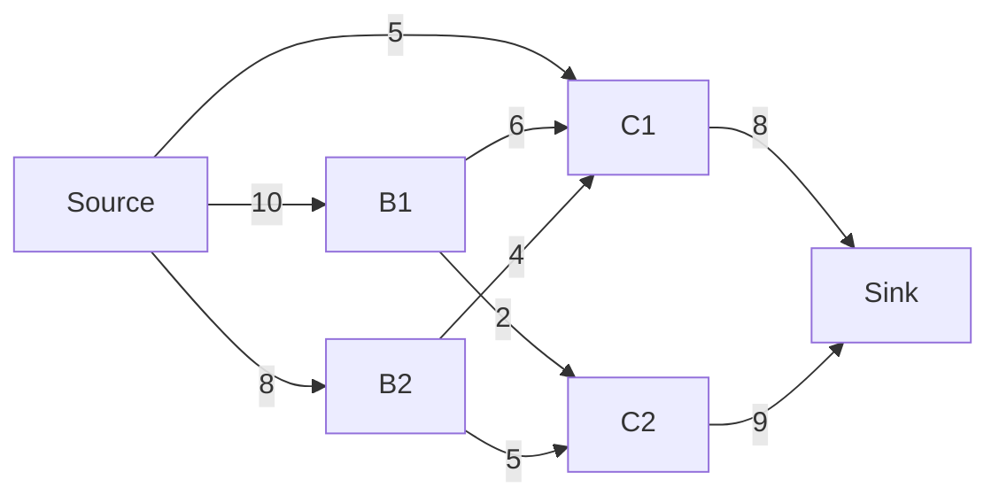
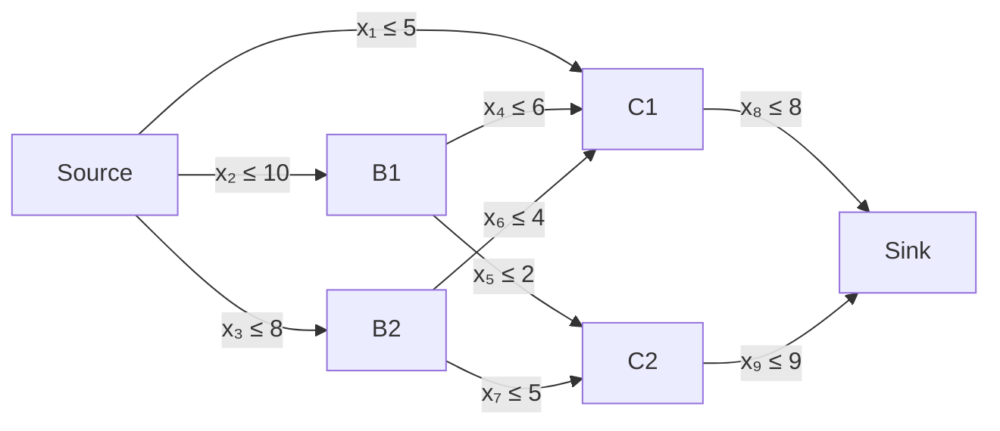

# LP Problem Examples

## Flow optimization
We have a network (represented as directed graph). The graph has a "Source" of a medium (it can be for example gas, water or electricity) and Sink with additional nodes in between. All edges between source and sink has defined maximal capacity.

What is the maximum amount medium we can transmit through the sink?

### Mathematical model

Let us first define our optimization variables $x_i$ as individual flows through the edges of our graph

we may then write the problem as

$$
\begin{aligned}
	\max_{\bm{x}} & \quad x_8 + x_9 \\
	\text{s.t.} & \quad \bm{0} \leq \bm{x} \leq \bm{u} \\
							& \quad x_4 + x_5 = x_2 \\
	            & \quad x_6 + x_7 = x_3 \\
	            & \quad x_8 = x_5 + x_6 + x_4 \\
	            & \quad x_9 = x_5 + x_7 \\
\end{aligned}
$$
where
$$
\bm{u}^\top = \begin{bmatrix} 5 & 10 & 8 & 6 & 2 & 4 & 5 & 8 & 9 \end{bmatrix}
$$

### Canonical form
Manipulating the objective into the canonical form can be done simply with
$$
\bm{c}^\top = \begin{bmatrix}
	0 & 0 & 0 & 0 & 0 & 0 & 0 & 1 & 1 \\
\end{bmatrix}
\,.
$$
To deal with the constraints let us first formulate the equality constraints in matrix form as:
$$
\bm{A}_{\mathrm{eq}} \bm{x} = \bm{0}
$$
where
$$
\bm{A}_{\mathrm{eq}} =
\begin{bmatrix}
	0 & -1 & 0 & 1 & 1 & 0 & 0 & 0 & 0 \\
	0 & 0 & -1 & 0 & 0 & 1 & 1 & 0 & 0 \\
	0 & 0 & 0 & -1 & -1 & -1 & 0 & 1 & 0 \\
	0 & 0 & 0 & 0 & -1 & 0 & -1 & 0 & 1 \\
\end{bmatrix}
\,.
$$
Equivalently we may write it as
$$
\bm{0} \leq \bm{A}_{\mathrm{eq}} \bm{x} \leq \bm{0} \,.
$$
Together with the upper bounds they can be now rewritten into the canonical form
$$
\underbrace{
\begin{bmatrix}
	\bm{E} \\
	\bm{A}_{\mathrm{eq}} \\
	-\bm{A}_{\mathrm{eq}}
\end{bmatrix}
}_{\bm{A}}
\bm{x}
\leq
\underbrace{
\begin{bmatrix}
	\bm{u} \\
	\bm{0} \\
	\bm{0}
\end{bmatrix}
}_{\bm{b}}
$$
