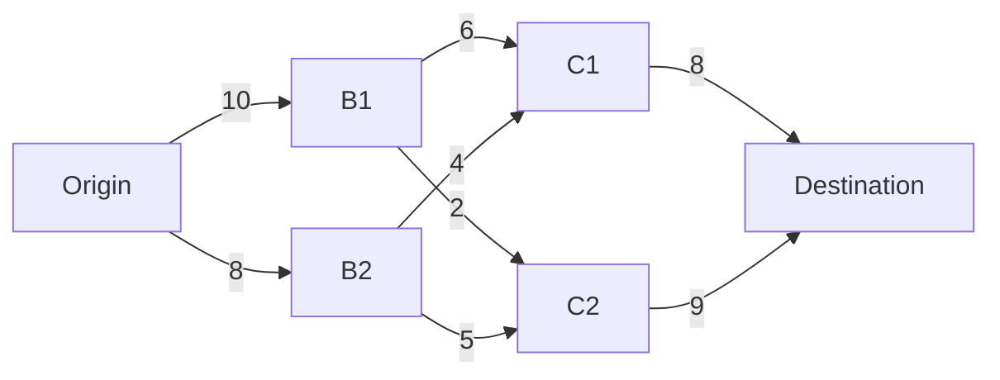
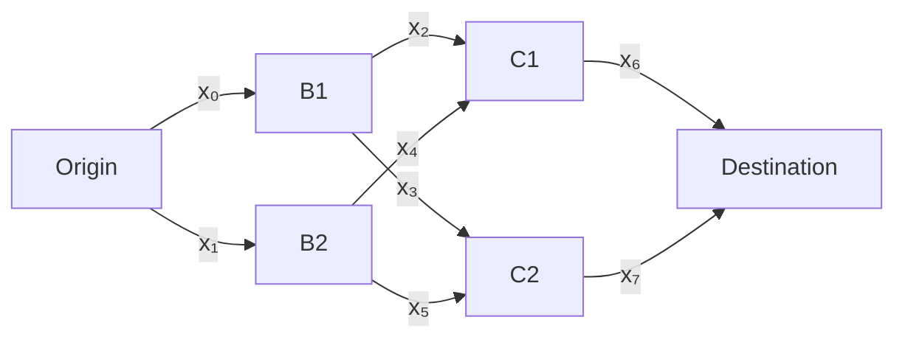

# Shortest Path Problem

Interestingly, the problem of finding the shortest path through a directed weighed graph has a tight approximation in the form of an LP. Let's consider a weighed graph

The weight of each edge can be regarded as a distance or any other abstract cost associated with traversing it.

## Mathematical Model

Let's assign decision variables $x_i$ to each edge of the graph.

If we select to traverse a specific edge $x_i = 1$ which is associated with the cost $c_i x_i$, where $c_i$ are the weights of individual edges. Naturally we must also include the constraint $x_6 + x_7 = 1$ to ensure that we traverse through the graph as well as constraints ensuring continuity in the graph's vertices. One would expect that $x_i$ would have to be binary, but they can be in fact continuous variables.

The problem as a whole takes the form
$$
\begin{aligned}
	\min_{x} & \quad c^\top x \\
	\text{s.t.} & \quad x \geq 0 \\
              & \quad x_6 + x_7 = 1 \\
							& \quad x_0 = x_2 + x_3 \\
	            & \quad x_1 = x_4 + x_5 \\
	            & \quad x_2 + x_4 = x_6 \\
	            & \quad x_3 + x_5 = x_7 \\
\end{aligned}
$$
where
$$
c^\top = \begin{bmatrix} 10 & 8 & 6 & 2 & 4 & 5 & 8 & 9 \end{bmatrix}
$$

## Undirected Graph Problem

If the graph is undirected we are solving the problem
$$
\begin{aligned}
	\min_{x} & \quad \sum_i c_i \|x_i\| \\
	\text{s.t.} & \quad x_6 + x_7 = 1 \\
							& \quad x_0 = x_2 + x_3 \\
	            & \quad x_1 = x_4 + x_5 \\
	            & \quad x_2 + x_4 = x_6 \\
	            & \quad x_3 + x_5 = x_7 \\
\end{aligned}
$$
This problem can in-fact be reformulated into an LP by introducing a vector of additional decision variables $y_i \geq 0$, where $y_i = 1$ if we traverse the given edge in the opposite direction
$$
\begin{aligned}
	\min_{x,y} & \quad c^\top x + c^\top y \\
	\text{s.t.} & \quad x \geq 0 \\
              & \quad y \geq 0 \\
              & \quad (x_6 - y_6) + (x_7 - y_7) = 1 \\
							& \quad (x_0 - y_0) = (x_2 - y_2) + (x_3 - y_3) \\
	            & \quad (x_1 - y_1) = (x_4 - y_4) + (x_5 - y_5) \\
	            & \quad (x_2 - y_2) + (x_4 - y_4) = (x_6 - y_6) \\
	            & \quad (x_3 - y_3) + (x_5 - y_5) = (x_7 - y_7) \\
\end{aligned}
$$
